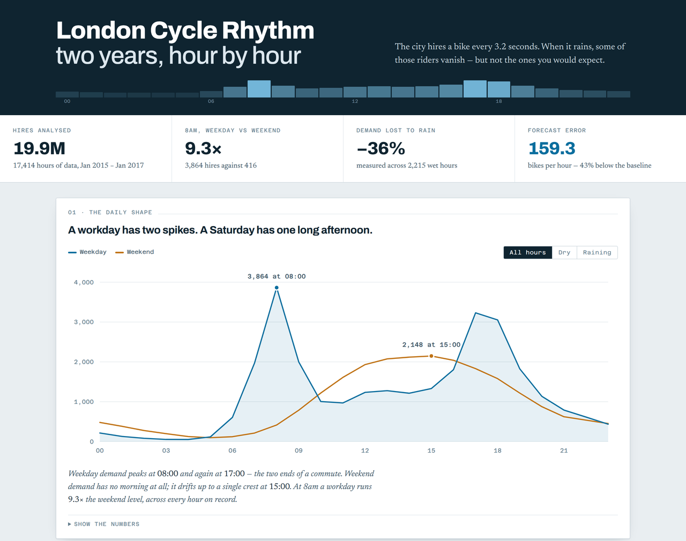

# London Cycle Rhythm

**[▶ Open the interactive dashboard](https://asadali-github.github.io/london-cycle-demand/)**

Two years of Transport for London cycle-hire counts — 17,414 hourly observations,
19.9 million bike hires — analysed end to end: what the city's daily rhythm looks
like, what weather costs it, and a demand forecast tested on three months the model
had never seen.

[](https://asadali-github.github.io/london-cycle-demand/)

## What the data says

**A workday and a weekend are different animals.** Weekday demand spikes twice — 3,864
hires at 08:00 and 3,232 at 17:00, the two ends of a commute. The weekend has no morning
at all; it drifts up to a single crest of 2,148 at 15:00. At 8am a workday runs **9.3×**
the weekend level.

**Rain removes about a third of all riding — but not evenly.** Comparing each hour against
its own normal (same hour, same kind of day), rain costs commuters **31%** of their trips
and weekend leisure riders **51%**. People who have to be somewhere still go; people
riding for pleasure stay in. On wet days the weekday/weekend 8am gap actually *widens*,
to 11.3×.

**Warmth pulls riders out, without limit.** Below freezing, demand sits at 0.68 of normal;
above 25°C it reaches 1.56 — a 2.3× spread that never turns back down. London does not
get hot enough to put cyclists off.

**The year repeats.** July runs at roughly twice the January rate, in both years covered,
and the two annual curves sit almost on top of each other. That regularity is what makes
the forecast possible.

## The forecast

Trained on 15,136 hours up to 30 September 2016, then asked for the 2,278 hours after it.
The split is strictly forward in time — a random split would leak future hours into
training and flatter every number below.

| Model | MAE (bikes/hour) | R² |
|---|---:|---:|
| Overall average (null model) | 786.7 | −0.020 |
| Hour-of-week average (the obvious baseline) | 277.5 | 0.755 |
| **Gradient boosting, 13 features** | **159.3** | **0.920** |

The model is **43% better than the seasonal baseline**. Reporting it against that baseline
rather than against the null model is deliberate: beating "the average hour" proves nothing,
because the calendar alone gets you most of the way. The remaining gain is what weather and
the finer calendar features actually buy.

## Method notes

The one decision that shapes every weather figure is **relative demand**: each hour is
divided by the mean for its own hour-of-day and day-type. Rain is not evenly distributed
across the day, so comparing raw wet-hour counts against dry-hour counts would partly
measure *when* it rains rather than what rain does. Dividing that out first makes 08:00 in
the rain comparable to 08:00 in the dry. A test asserts every group averages exactly 1.000.

Other choices worth stating plainly: the feed is missing 130 hours (0.74%), which are left
as gaps rather than interpolated; the final month is excluded from the monthly chart because
the data stops on 3 January 2017 and a three-day month would draw a cliff that isn't real;
and thunder and snow rest on 14 and 60 observed hours respectively, so the dashboard marks
them and the text calls them direction, not precision.

## Run it yourself

```bash
pip install -r requirements.txt

python analysis.py           # every finding above, printed; writes results.json
python build_dashboard.py    # rebuilds index.html from that results.json
python -m pytest tests/ -v   # 11 tests
```

The dashboard reads only `results.json`, so no number on the page can drift away from the
analysis that produced it. Rerun `analysis.py` on new data and the page updates itself.

## Tests

The 11 tests guard the claims, not just the imports: that `rel` really is centred on 1.0
within every hour-and-day-type group, that the train/test split never runs backwards in
time, that the model still beats *both* baselines, that the temperature response has not
doubled back, that leisure riding is still the harder-hit group, and that the three hourly
profiles partition the dataset exactly.

## Files

| File | What |
|---|---|
| `analysis.py` | The whole analysis: load → validate → quantify → forecast. Writes `results.json`. |
| `build_dashboard.py` | Inlines `results.json` into the page template, emits `index.html`. |
| `dashboard_body.html` | Page template — layout, styles, and hand-built SVG charts. |
| `index.html` | The built dashboard, self-contained. This is what GitHub Pages serves. |
| `data/london_bikes.csv` | 17,414 hourly rows: hire counts joined to weather. |
| `results.json` | Every aggregate the dashboard draws, produced by `analysis.py`. |
| `tests/test_analysis.py` | 11 tests over the findings and the model. |

## Data

Transport for London cycle-hire counts joined to hourly weather observations, 4 January
2015 – 3 January 2017. Columns: hire count, real and feels-like temperature, humidity, wind
speed, weather code, holiday and weekend flags, season. The counts are TfL open data, used
under the Open Government Licence. The code in this repository is MIT-licensed.

## Limitations

Two years is enough for two summers, so "the pattern repeats annually" rests on a single
repetition. The dataset is system-wide, so nothing here says *where* in London the riding
happens. The forecast uses observed weather, not forecast weather — in production the
error would grow by whatever the weather forecast itself gets wrong. And the model is
evaluated on one contiguous quarter (October–December); a different quarter would give a
different number, though the baseline comparison would move with it.

## Author

**Asad Ali** — MSc Data Science, University of Essex.
[LinkedIn](https://www.linkedin.com/in/asad-ali-2a3210177) ·
[GitHub](https://github.com/Asadali-Github)
